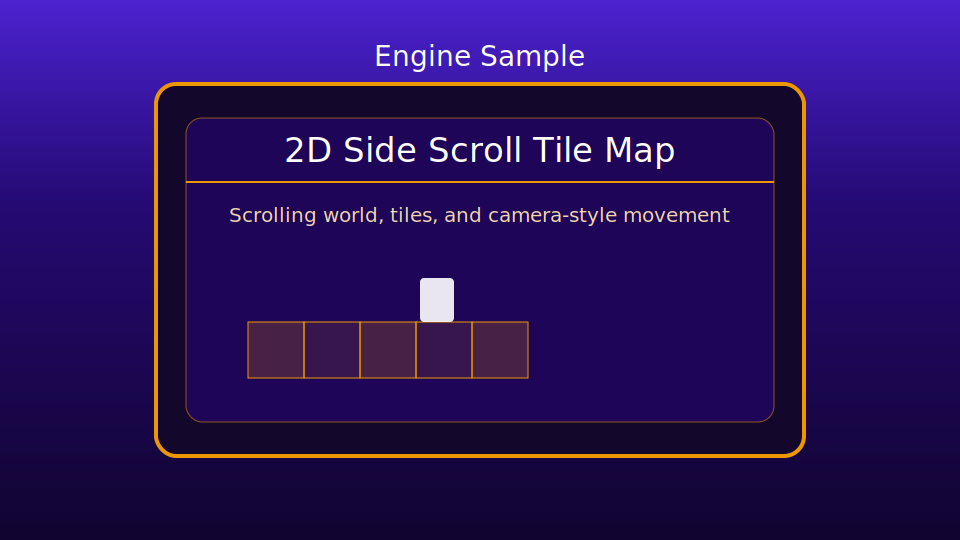

# 2D Side Scroll Tile Map

This sample demonstrates a simple side-scrolling tile map with a player character, camera follow behavior, and a lightweight state flow built on the shared engine runtime.

## Preview

## What It Shows
- `GameBase` lifecycle with attract, player select, play, pause, and game-over states.
- Tile-map and camera integration through `TileMap` and the sample `Hero`.
- Keyboard/controller player-select flow via shared `engine/game/gameUtils.js`.
- Basic controller support for start, pause, attract-scene movement, and demo play actions.

## Controls
- `Enter`, `NumpadEnter`, or controller `Start`: begin from attract or restart from game over.
- Player select: keyboard `1`/`2` or controller `Left Bumper`/`Right Bumper`.
- Attract movement: arrow keys or controller D-pad.
- Play demo actions:
  `S` or controller `A` adds score.
  `D` or controller `B` triggers player death/swap.
  `P` or controller `Select` pauses/unpauses.

## Notes
- This sample is engine-driven: `GameBase` owns the runtime loop and input lifecycle.
- `game.js` is now the runtime shell and state router.
- `sideScrollStateHandlers.js` owns state-specific screen flow and player-select/play/pause/game-over behavior.
- `gameAttract.js` owns the attract-scene world preview.
- `global.js` owns screen copy plus shared sample config.
- `hero.js` owns player movement used by the attract scene and tile map.
- This sample is meant to teach scrolling/tile-map integration more than finished game rules.
