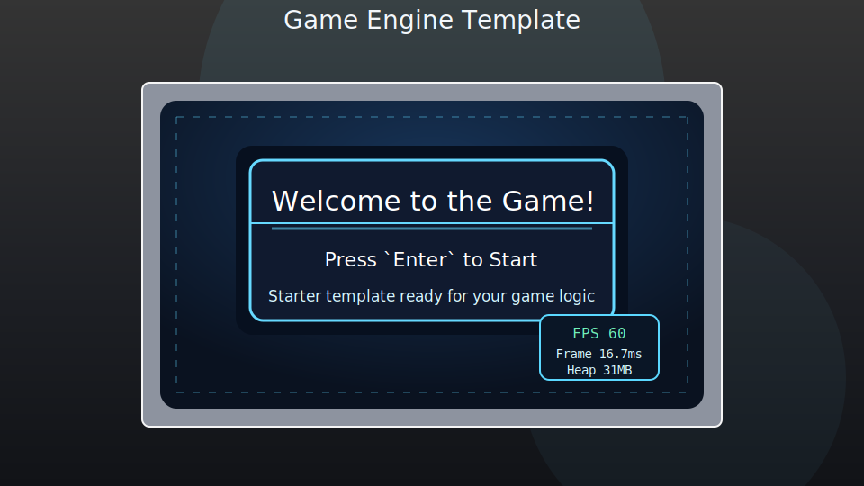

# Game Engine Sample

This sample is the engine template reference for lifecycle flow and state transitions.

## Template Metadata
- Template version: `1.3.0`
- Last updated: `2026-03-15`
- Change log: [`CHANGELOG.md`](./CHANGELOG.md)

## What It Shows
- `GameBase` initialization and frame-loop lifecycle.
- Basic game-state flow: `attract` -> `playerSelect` -> `initGame` -> `playGame` -> `gameOver`.
- Keyboard/controller-driven pause plus keyboard-driven score and player-life flow.
- Fullscreen and performance overlays via engine runtime context.
- Debug state-transition logging (`?game`) for onboarding and troubleshooting.

## Preview

Attract-state preview of the current starter layout and theme.

## Controls
- `Enter` or controller `Start`: start from attract or restart from game over.
- Player select: keyboard `1`/`2` or controller `Left Bumper`/`Right Bumper`.
- `P` or controller `Select`: pause/unpause during gameplay.
- `S`: add score to the current player.
- `D`: trigger player death/swap flow.

## Optional Query Flags
- `?game` enables sample debug logging.
- `?perf` enables the performance overlay.
- `?layout` enables safe-area layout guides.

## Commands
- Node test suite: `npm test`
- Browser test suite: start a local web server, then open `/tests/testRunner.html`
- Optional sample debug: open `samples/engine/Game Engine/index.html?game`
- Optional layout debug: open `samples/engine/Game Engine/index.html?layout`

## Notes
- `game.js` owns lifecycle wiring and state switching.
- `game.js` uses a `stateHandlers` map to route the active state to its handler.
- `gameStates.js` contains state-specific render/update handlers.
- `gameStateUi.js` contains shared canvas screen-render helpers for state handlers.
- `gameInput.js` contains shared input checks for state handlers.
- `CanvasUtils` provides canvas primitives and safe-area guides.
- `CanvasText` owns text metrics plus centered/multiline text rendering.
- Quick theme tuning lives in `global.js` under `gameUi.theme`, `gameUi.screens`, `gameUi.performance`, and the minimal `playerSelect` config.
- Reusable flow helpers stay in `engine/game/gameUtils.js`.
- Lifecycle cleanup is owned by `GameBase.destroy()` plus the sample `onDestroy()` reset.

## Start A New Game From This Template
1. Copy this folder and rename it to your new game name.
2. Update `index.html` title/header and `global.js` config values.
3. Replace state handlers in `game.js` and UI helpers in `gameStateUi.js` with game-specific logic.
4. Keep `onInitialize()` and `onDestroy()` ownership clear for listeners/resources.
5. Keep runtime debug behind `?yourGameFlag` and avoid unconditional `console.*` calls.
6. Run smoke pass on load, input flow, pause/resume, restart, and cleanup.

## Rename Checklist
1. Rename folder and update sample name in `README.md`.
2. Update `index.html` `<title>` and `<h1>`.
3. Set a new debug flag key in `game.js` (for example `?myNewGame`).
4. Copy `TODO-template.txt` to `todo.txt` in your new game folder.
5. Update local `todo.txt` and top-level `samples/todo.txt` entries to new folder name.
6. Add or replace preview image under `assets/`.

Example copy command:
- PowerShell: `Copy-Item TODO-template.txt todo.txt`
- Bash: `cp TODO-template.txt todo.txt`

Use [`STARTER_CHECKLIST.md`](./STARTER_CHECKLIST.md) for handoff, [`TODO-template.txt`](./TODO-template.txt) to start local work, and [`VISUAL_REGRESSION_CHECKLIST.md`](./VISUAL_REGRESSION_CHECKLIST.md) for canvas updates.
