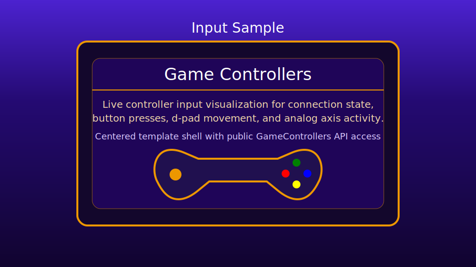

# Game Controllers Sample

This sample demonstrates gamepad/controller input visualization using:
- `engine/input/controller/gameControllers.js`
- direct canvas rendering in `game.js`

Design choice: this sample is intentionally DOM/canvas-driven and focused on showing real-time controller state.

## Preview

## Files

- `index.html`: sample page shell
- `styles.css`: page and canvas styling
- `game.js`: controller lifecycle, polling updates, and rendering

## Controls

- Connect one or more controllers/gamepads.
- Press controller buttons to highlight button indicators.
- Use d-pad to move each player marker.
- Move analog sticks to observe axis values (`StickLeftX/Y`, `StickRightX/Y`).

## Behavior Notes

- The sample updates controller state each animation frame and renders compact per-controller panels.
- Cleanup is handled on `pagehide`/`beforeunload` and calls `gameControllers.destroy()`.
- Device mapping support and deadzone filtering come from engine controller modules.
