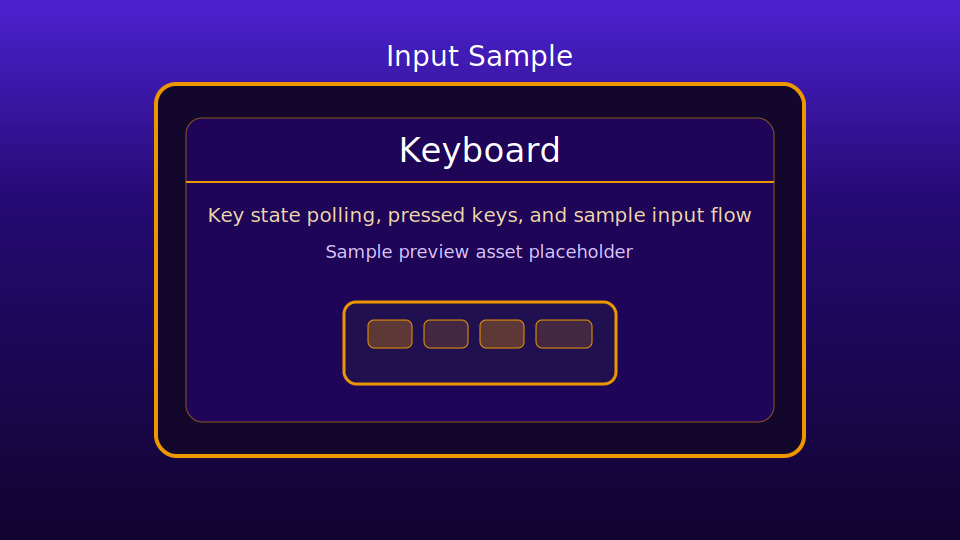

# Keyboard Sample

This sample demonstrates live keyboard input state tracking using:
- `engine/input/keyboard.js`
- render/update loop via `engine/core/gameBase.js`
- canvas drawing via `engine/core/canvas.js`

Design choice: this sample is intentionally DOM-driven at the page level, with keyboard state orchestration in `game.js`.

## Preview

## Files

- `index.html`: sample page shell
- `styles.css`: page and canvas styling
- `global.js`: sample configuration
- `game.js`: keyboard input orchestration and rendering

## Controls

- Press and hold keys to see:
  - `Keys Just Pressed`
  - `Keys Currently Pressed`
  - `Keys Just Released`
- Press `R` to fill the left rectangle red.
- Press `G` to fill the right rectangle green.

## Behavior Notes

- Keyboard rollover differs by hardware; some key combinations may not register together.
- This sample uses browser keyboard events and is intended for desktop keyboard testing.
- Lifecycle cleanup follows engine ownership conventions via `GameBase.destroy()` and `KeyboardInput.destroy()`.
- No reusable keyboard helper extraction is needed right now; this sample logic is specific to this visualization.
