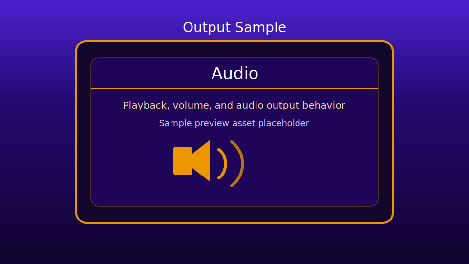

# Audio Sample

This sample demonstrates basic audio loading and playback through:
- `engine/output/audioPlayer.js`
- `engine/output/audioPlaybackController.js`
- a small DOM control surface in `index.html`
- a focused module entry in `audio.js`

## Preview

## Files

- `index.html`: sample page and controls
- `audio.js`: UI wiring, status/error updates, and lifecycle hooks
- `audioData.js`: sample audio catalog used by the playback controller
- `fx/`: bundled audio clips used by the sample
- `requirements.txt`: source attributions/requirements

## Controls

- `Audio sample` dropdown: choose which clip to play
- `Play Selected`: play the chosen clip
- `Stop All`: stop active playback managed by `AudioPlayer`

Options in the dropdown are populated dynamically from `audioData.js`.

## Included Audio

- `elemental-magic.mp3`
- `relaxing-guitar-loop.mp3`
- `Alesis-Sanctuary.wav`
- `Ouch-6.wav`

## Audio File Types

- Current sample uses: `.mp3`, `.wav`
- `AudioPlayer` relies on browser decode support (`AudioContext.decodeAudioData`), so playable types can vary by browser

## Browser Audio Note

Some browsers block audio output until the first user interaction.  
If no sound plays initially, click `Play Selected` once to unlock audio.

## Lifecycle Note

The sample calls `orchestrator.destroy()` on `beforeunload` to release audio resources cleanly.
