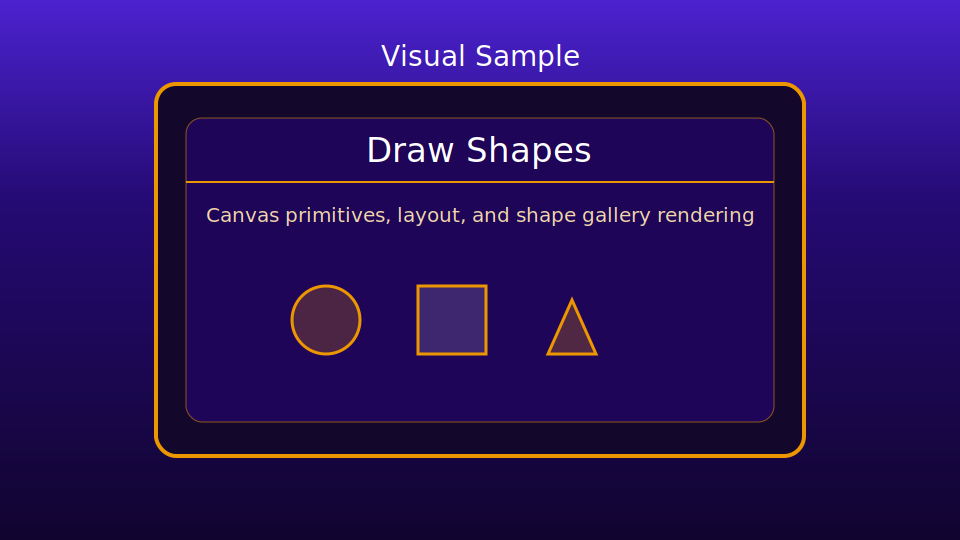

# Draw Shapes Sample

This sample demonstrates engine-driven canvas shape rendering primitives inside a cleaner sample shell similar to the updated `Fullscreen Gaming` example.

It uses:
- `engine/core/gameBase.js`
- `engine/core/canvasUtils.js`
- `engine/core/canvasText.js`
- sample state routing and rendering in `game.js`

## Preview

## Files

- `index.html`: module boot shell and sample header
- `global.js`: canvas, fullscreen, performance, and sample UI config
- `game.js`: `GameBase` lifecycle shell, state routing, and stage rendering
- `drawShapesArt.js`: shape gallery drawing helpers
- `styles.css`: centered sample layout and stage presentation

## Behavior

- Starts on an attract screen, then toggles into the shape gallery with `Enter` or `Space`.
- Draws circles, squares, triangle, oval, grid lines, and layered rectangles in the gallery view.
- Uses engine fullscreen and performance overlays via `GameBase` runtime integration.

## Notes

- Shape methods are intentionally sample-local for readability.
- Consider engine extraction only if these helpers are reused by other samples/games.

