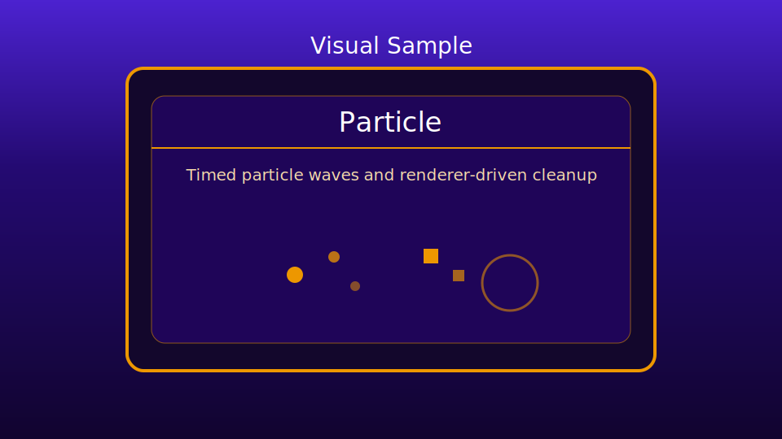

# Particle Sample

This sample demonstrates timed particle explosion waves using the engine `ParticleExplosion` renderer inside the updated visual-sample shell.

## What It Shows
- Engine-driven sample (`GameBase`) with a standard game loop.
- Repeating explosion waves with circle and square particle modes.
- Automatic particle lifecycle cleanup after each explosion.
- A cleaner visual sample shell consistent with the other refreshed visual examples.

## Preview

## Run
1. Open `samples/visual/Particle/index.html` in a browser.
2. Watch timed explosion waves render in the canvas.

## Debug
- `?particle` enables sample debug logging.
- `?debugTrace` adds stack traces to engine debug logs.
- `?noDebugCaller` hides caller information in debug log messages.

## Notes
- The sample keeps orchestration in `game.js` and uses engine-renderer behavior for particle internals.
- `global.js` owns canvas/fullscreen/performance config, page shell copy, and the current wave layout data.
- Inputs are sanitized before creating explosions to avoid invalid config values.
- Wave timing is updated before drawing, so newly spawned explosions render in the same frame they are created.
